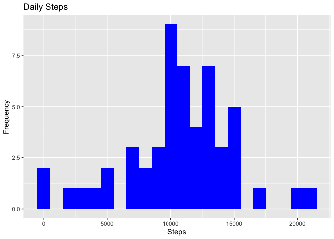
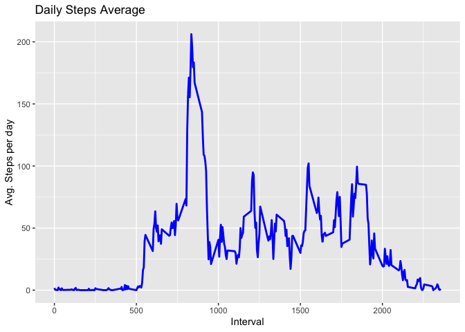
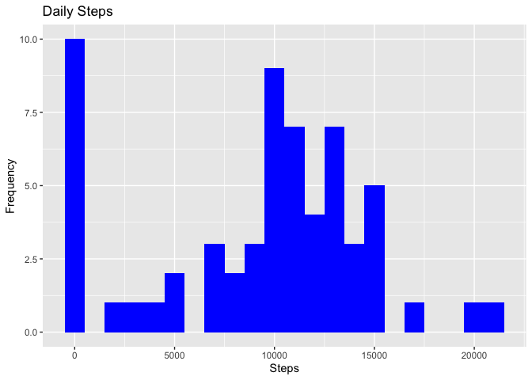
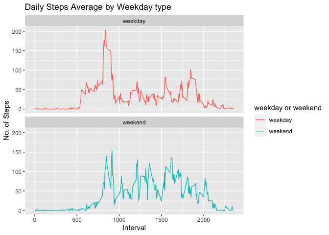

## Introduction
This is a markdown file which forms a part of the Week 2 Assignment in Reproducible Research in Coursera. The object is to carry out a simple set of data analysis tasks and write a report using R markdown.

### Problem Stattement

It is now possible to collect a large amount of data about personal movement using activity monitoring devices such as a Fitbit, Nike Fuelband, or Jawbone Up. These type of devices are part of the “quantified self” movement – a group of enthusiasts who take measurements about themselves regularly to improve their health, to find patterns in their behavior, or because they are tech geeks. But these data remain under-utilized both because the raw data are hard to obtain and there is a lack of statistical methods and software for processing and interpreting the data.

This assignment makes use of data from a personal activity monitoring device. This device collects data at 5 minute intervals through out the day. The data consists of two months of data from an anonymous individual collected during the months of October and November, 2012 and include the number of steps taken in 5 minute intervals each day.

### Data used in this report

There are two ways to get hold of data used in this report.

 - The data for this assignment can be downloaded from the course web site:
Dataset: [Activity monitoring data](https://d396qusza40orc.cloudfront.net/repdata%2Fdata%2Factivity.zip)

 - The *activity.zip* file has been included in the [template repository](http://github.com/rdpeng/RepData_PeerAssessment1). When we fork the repo and start working on it, the zip file is already present in there!
 
The variables included in this dataset are:

* **steps**: Number of steps taking in a 5-minute interval (missing values are coded as NA)

* **date**: The date on which the measurement was taken in YYYY-MM-DD format

* **interval**: Identifier for the 5-minute interval in which measurement was taken

The dataset is stored in a comma-separated-value (CSV) file and there are a total of 17,568 observations in this dataset.


## Loading and preprocessing the data
We shall use the data zipped in the template report as opposed to downloading it anew from the course website. 

```r
if(!file.exists("data")) {
  dir.create("data")
}
unzip(zipfile = "./activity.zip", exdir = "./data")
list.files("./data")
```

```
## [1] "activity.csv"          "processedActivity.csv"
```
The last line of the code block lists the files in data folder. This can be used to verify if the unzipping action was successful.

Now that we have the data in a csv formatted file, lets load it into R Global Environment so that we can work with it. Here, we use Data.Table structures for handling data and ggplot2 for plotting.

```r
library(data.table)
library(ggplot2)
activityDT <- data.table::fread(input = "./data/activity.csv")
```

## What is mean total number of steps taken per day?

In the problem statement, it explicitly mentions that we can ignore the missing values in the dataset while answering this question.
Lets compute the stotal number of steps taken per day before plotting them.

```r
totalSteps <- activityDT[, c(lapply(.SD, sum, na.rm = FALSE)), .SDcols = c("steps"), by = .(date)]
# Visualize the totalSteps
head(totalSteps)
```

```
##          date steps
## 1: 2012-10-01    NA
## 2: 2012-10-02   126
## 3: 2012-10-03 11352
## 4: 2012-10-04 12116
## 5: 2012-10-05 13294
## 6: 2012-10-06 15420
```
### Histogram of total steps taken each day
Now lets plot the histogram of the total number of steps taken each day

```r
ggplot(totalSteps, aes(x = steps)) +
    geom_histogram(fill = "blue", binwidth = 1000) +
    labs(title = "Daily Steps", x = "Steps", y = "Frequency")
```

```
## Warning: Removed 8 rows containing non-finite values (stat_bin).
```

<!-- -->
Note the warning above the graph where values with NA have been ignored.

### Mean and median of total number of steps
Calculate and report the mean and median total number of steps taken per day. 

```r
meanSteps <- mean(totalSteps$steps, na.rm = TRUE)
medianSteps <- median(totalSteps$steps, na.rm = TRUE)
```
The mean of the steps taken per day is 1.0766189\times 10^{4}.
The median of the steps taken per day is 10765.

## What is the average daily activity pattern?
1. Make a time series plot (i.e. `type = "l"`) of the 5-minute interval (x-axis) and the average number of steps taken, averaged across all days (y-axis)

```r
timeSeriesDT <- activityDT[, c(lapply(.SD, mean, na.rm = TRUE)), .SDcols = c("steps"), by = .(interval)]
ggplot(timeSeriesDT, aes(x = interval, y = steps)) + 
  geom_line(color="blue", size=1) + 
  labs(title = "Daily Steps Average", x = "Interval", y = "Avg. Steps per day")
```

<!-- -->

2. Which 5-minute interval, on average across all the days in the dataset, contains the maximum number of steps?

```r
timeSeriesDT[steps == max(steps), .(internal_with_MaxSteps = interval)]
```

```
##    internal_with_MaxSteps
## 1:                    835
```


## Imputing missing values
Note that there are a number of days/intervals where there are missing values (coded as NA). The presence of missing days may introduce bias into some calculations or summaries of the data.

1. Calculate and report the total number of missing values in the dataset (i.e. the total number of rows with NAs)

```r
activityDT[is.na(steps), .N]  # Total number of missing values in dataset
```

```
## [1] 2304
```

2. Devise a strategy for filling in all of the missing values in the dataset. The strategy does not need to be sophisticated. For example, you could use the mean/median for that day, or the mean for that 5-minute interval, etc.

```r
# Use median to fill in the missing values
activityDT[is.na(steps), "steps"] <- activityDT[, c(lapply(.SD, median, na.rm=TRUE)), .SDcols = c("steps")]
```


3. Create a new dataset that is equal to the original dataset but with the missing data filled in.

```r
data.table::fwrite(x=activityDT, file = "./data/processedActivity.csv", quote = FALSE)
list.files("./data")
```

```
## [1] "activity.csv"          "processedActivity.csv"
```

4. Make a histogram of the total number of steps taken each day and Calculate and report the mean and median total number of steps taken per day. Do these values differ from the estimates from the first part of the assignment? What is the impact of imputing missing data on the estimates of the total daily number of steps?

```r
# Total Steps in the cleaned up dataset
totalSteps2 <- activityDT[, c(lapply(.SD, sum)), .SDcols = ("steps"), by = .(date)]

# mean and median of the total number of steps in the cleaned up dataset
meanSteps2 <- mean(totalSteps2$steps)
medianSteps2 <- median(totalSteps2$steps)

# Plot the histogram of total number of steps in the cleaned up dataset
ggplot(totalSteps2, aes(x = steps)) +
    geom_histogram(fill = "blue", binwidth = 1000) +
    labs(title = "Daily Steps", x = "Steps", y = "Frequency")
```

<!-- -->

Dataset | Mean Steps | Median Steps
--- | --- | ---
Original dataset (with NA) | 1.0766189\times 10^{4} | 10765
Cleaned-up dataset (NAs replaced with median) | 9354.2295082 | 10395

## Are there differences in activity patterns between weekdays and weekends?
For this part the weekdays() function may be of some help here. Use the dataset with the filled-in missing values for this part.

1. Create a new factor variable in the dataset with two levels – “weekday” and “weekend” indicating whether a given date is a weekday or weekend day.

```r
# read in the proessed data into a new variable and start afresh
pactivityDT <- data.table::fread(input = "./data/processedActivity.csv")

# Preprocessing for identifying weekdays/weekends
pactivityDT[, date:= as.POSIXct(date, format = "%Y-%m-%d")] # Format the date into a known standard form
pactivityDT[, `Day of the Week`:= weekdays(x=date)] # Set days of the week
pactivityDT[grepl(pattern = "Monday|Tuesday|Wednesday|Thursday|Friday", x = `Day of the Week`), "weekday or weekend"] <- "weekday"
pactivityDT[grepl(pattern = "Saturday|Sunday", x = `Day of the Week`), "weekday or weekend"] <- "weekend"
pactivityDT[, `weekday or weekend`:= as.factor(`weekday or weekend`)]
head(pactivityDT)
```

```
##    steps       date interval Day of the Week weekday or weekend
## 1:     0 2012-10-01        0          Monday            weekday
## 2:     0 2012-10-01        5          Monday            weekday
## 3:     0 2012-10-01       10          Monday            weekday
## 4:     0 2012-10-01       15          Monday            weekday
## 5:     0 2012-10-01       20          Monday            weekday
## 6:     0 2012-10-01       25          Monday            weekday
```

2. Make a panel plot containing a time series plot (i.e. type = "l") of the 5-minute interval (x-axis) and the average number of steps taken, averaged across all weekday days or weekend days (y-axis). The plot should look something like the following, which was created using simulated data:


```r
pactivityDT[is.na(steps), "steps"] <- activityDT[, c(lapply(.SD, median, na.rm = TRUE)), .SDcols = c("steps")]
ptimeSeriesDT <- pactivityDT[, c(lapply(.SD, mean, na.rm = TRUE)), .SDcols = c("steps"), by = .(interval, `weekday or weekend`)] 

ggplot(ptimeSeriesDT , aes(x = interval , y = steps, color=`weekday or weekend`)) + geom_line() + labs(title = "Daily Steps Average by Weekday type", x = "Interval", y = "No. of Steps") + facet_wrap(~`weekday or weekend` , ncol = 1, nrow=2)
```

<!-- -->

